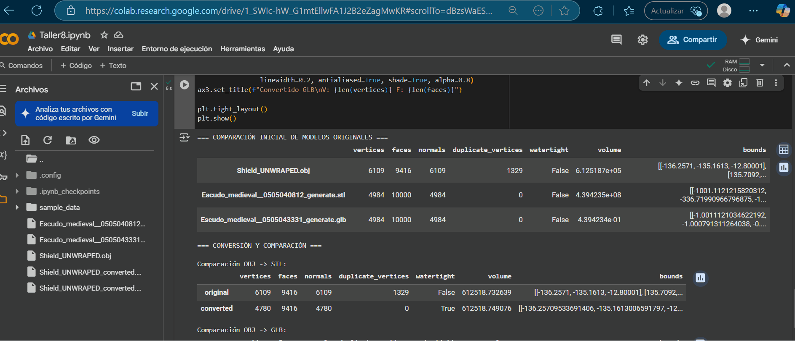

# 🧪 Importando el Mundo: Visualización y Conversión de Formatos 3D
## 📅 Fecha
`2025-05-05` – Fecha de entrega

---

## 🎯 Objetivo del Taller

Comparar y convertir entre distintos formatos de modelos 3D: .OBJ, .STL y .GLTF, y visualizar sus diferencias en geometría y materiales. El objetivo es entender la estructura interna de los archivos 3D, su compatibilidad entre entornos, y cómo se interpretan en distintas plataformas de visualización.

---

## 🧠 Conceptos Aprendidos

Lista los principales conceptos aplicados:

- [ ] Manipulación de modelos 3D
- [ ] Análisis de modelos
- [ ] Conversión entre formatos

---

## 🔧 Herramientas y Entornos

Especifica los entornos usados:

- Python (`opencv-python`, `torch`, `mediapipe`, `diffusers`, etc.)
- Three.js / React Three Fiber
- Jupyter / Google Colab

📌 Usa las herramientas según la [guía de instalación oficial](./guia_instalacion_entornos_visual.md)

---

## 📁 Estructura del Proyecto

```
2025-05-05_taller_conversion_formatos_3d/
├── threejs/              
├── python/                  
├── README.md
```

📎 Sigue la estructura de entregas descrita en la [guía GitLab](./guia_gitlab_computacion_visual.md)

---

## 🧪 Implementación

Explica el proceso:

### 🔹 Etapas realizadas
1. Configuración del Entorno y Carga de Librerías
2. Carga de Modelos 3D.
3. Comparación de Propiedades.
4. Visualización de Modelos y Propiedades.
5. Conversión de Formatos

### 🔹 Código relevante

Incluye un fragmento que resuma el corazón del taller:

```python
# 1. Comparación inicial de modelos originales
print("=== COMPARACIÓN INICIAL DE MODELOS ORIGINALES ===")
initial_results = {}
for path in model_files:
    mesh = load_model(path)
    initial_results[Path(path).name] = analyze_model(mesh)
visualize_comparison(initial_results)
```

---

## 📊 Resultados Visuales

### 📌 Este taller **requiere explícitamente un GIF animado**:

> ✅ Si tu taller lo indica, debes incluir **al menos un GIF** mostrando la ejecución o interacción.



> ❌ No se aceptará la entrega si falta el GIF en talleres que lo requieren.

---

## 🧩 Prompts Usados

Enumera los prompts utilizados:

```text
(1)"Write Python code in a Colab or Jupyter Notebook that uses the trimesh and open3d libraries to load three different 3D model files in .OBJ, .STL, and .GLTF formats. For each loaded model, print the number of vertices and faces. Additionally, determine and print whether each model has vertex and face normals, and if trimesh detects any duplicate vertices or degenerate faces. Finally, display each of the loaded models in a separate interactive viewer using the visualization capabilities of both trimesh and open3d."

(2)"Extend the Python code from the previous step. Create a function that takes a loaded 3D model (either from trimesh or open3d) as input and returns a dictionary containing its vertex count, face count, the presence of normals, and (if using trimesh) information about duplicate vertices and degenerate faces. Apply this function to the three loaded models and print the resulting property dictionaries for comparison. Subsequently, using the trimesh.exchange module, convert the .OBJ model to .STL format and the .STL model to .GLTF format. Load the converted models and print their properties using the same function to observe any changes during the conversion process."
```

📎 Usa buenas prácticas de prompts según la [guía de IA actualizada](./guia_prompts_inteligencias_artificiales_actualizada.md)

---

## 💬 Reflexión Final

Responde en 2-3 párrafos:

- Realmente no era consciente de la cantidad y la disparidad de formatos existentes para modelos 3D. Esto me ha dejado impresionado bastante y me genera una preocupación inicial respecto a la posible complejidad de trabajar con ciertos formatos en el futuro.

---