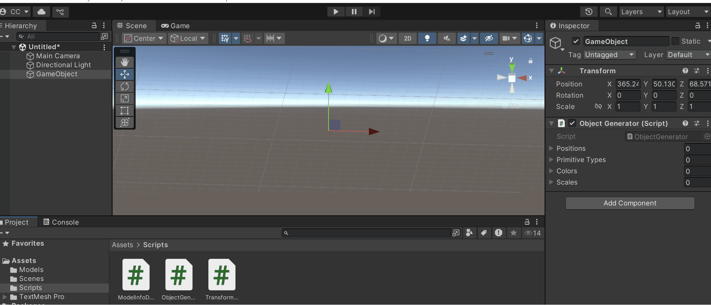

# 🧪 Escenas Paramétricas: Creación de Objetos desde Datos

## 📅 Fecha
`2025-05-05` – Fecha de entrega 
---

## 🎯 Objetivo del Taller

Generar objetos 3D de manera programada a partir de listas de coordenadas o datos estructurados. El propósito es entender cómo crear geometría en tiempo real y de forma flexible mediante código, utilizando bucles, estructuras condicionales y exportando o renderizando las escenas generadas.
---

## 🧠 Conceptos Aprendidos

Lista los principales conceptos aplicados:

- [ ] Instanciación de Objetos en Tiempo de Ejecución
- [ ] Fundamentos de Scripting en C# para Unity
- [ ] Conceptos de Componentes

---

## 🔧 Herramientas y Entornos

Especifica los entornos usados:

- Python (`opencv-python`, `torch`, `mediapipe`, `diffusers`, etc.)
- Unity (versión LTS, XR Toolkit, Shader Graph)

- Google Colab

📌 Usa las herramientas según la [guía de instalación oficial](./guia_instalacion_entornos_visual.md)

---

## 📁 Estructura del Proyecto

```
2025-05-05_taller_escenas_parametricas/
├── unity/               
├── python/                 
├── README.md
```

📎 Sigue la estructura de entregas descrita en la [guía GitLab](./guia_gitlab_computacion_visual.md)

---

## 🧪 Implementación

Explica el proceso:

### 🔹 Etapas realizadas
1. Crear un Nuevo Proyecto Unity.
2. Crear el Script de Generación.
3. Implementación de la Generación de Objetos.
4. Instanciar Primitivas.
5. Posicionar los Objetos
6. Aplicar Color

### 🔹 Código relevante

Incluye un fragmento que resuma el corazón del taller:

```python
def generate_primitives(coords):
    vedo_objects = []
    trimesh_objects = []
    open3d_objects = []

    for i, (x, y, z) in enumerate(coords):
        # Variar parámetros según condiciones
        size = 0.5 + i * 0.05  # Tamaño creciente
        color = (random.random(), random.random(), random.random())

        # Condicional para elegir tipo de primitiva
        if i % 3 == 0:
            # Cubo
            vedo_obj = vedo.Cube(pos=(x, y, z), side=size, c=color)
            trimesh_obj = trimesh.creation.box((size, size, size))
            trimesh_obj.apply_translation((x, y, z))

            open3d_obj = o3d.geometry.TriangleMesh.create_box(width=size, height=size, depth=size)
            open3d_obj.translate((x, y, z))
            open3d_obj.paint_uniform_color(color)

        elif i % 3 == 1:
            # Esfera
            vedo_obj = vedo.Sphere(pos=(x, y, z), r=size/2, c=color)
            trimesh_obj = trimesh.creation.icosphere(radius=size/2)
            trimesh_obj.apply_translation((x, y, z))

            open3d_obj = o3d.geometry.TriangleMesh.create_sphere(radius=size/2)
            open3d_obj.translate((x, y, z))
            open3d_obj.paint_uniform_color(color)

        else:
            # Cilindro (con altura variable)
            height = size * 1.5
            vedo_obj = vedo.Cylinder(pos=(x, y, z), r=size/2, height=height, axis=(0, 1, 0), c=color)
            trimesh_obj = trimesh.creation.cylinder(radius=size/2, height=height)
            trimesh_obj.apply_translation((x, y, z))

            open3d_obj = o3d.geometry.TriangleMesh.create_cylinder(radius=size/2, height=height)
            open3d_obj.translate((x, y, z))
            open3d_obj.paint_uniform_color(color)

        vedo_objects.append(vedo_obj)
        trimesh_objects.append(trimesh_obj)
        open3d_objects.append(open3d_obj)

    return vedo_objects, trimesh_objects, open3d_objects

```

---

## 📊 Resultados Visuales

### 📌 Este taller **requiere explícitamente un GIF animado**:

> ✅ Si tu taller lo indica, debes incluir **al menos un GIF** mostrando la ejecución o interacción.



> ❌ No se aceptará la entrega si falta el GIF en talleres que lo requieren.

---

## 🧩 Prompts Usados

Enumera los prompts utilizados:

```text
"Write a C# script for Unity that, upon execution, instantiates multiple primitive GameObjects (spheres, cubes, and cylinders) in the scene. Use arrays or lists of Vector3 coordinates to define the positions where these objects should be created. Ensure that each object is placed at a unique coordinate from the provided lists/arrays."
```

📎 Usa buenas prácticas de prompts según la [guía de IA actualizada](./guia_prompts_inteligencias_artificiales_actualizada.md)

---

## 💬 Reflexión Final

Responde en 2-3 párrafos:

- Soy nuevo en Unity y estos talleres me han obligado a mejorar en el uso del motor. No sabía que se podían dar tantas características a objetos hechos en código.

---
