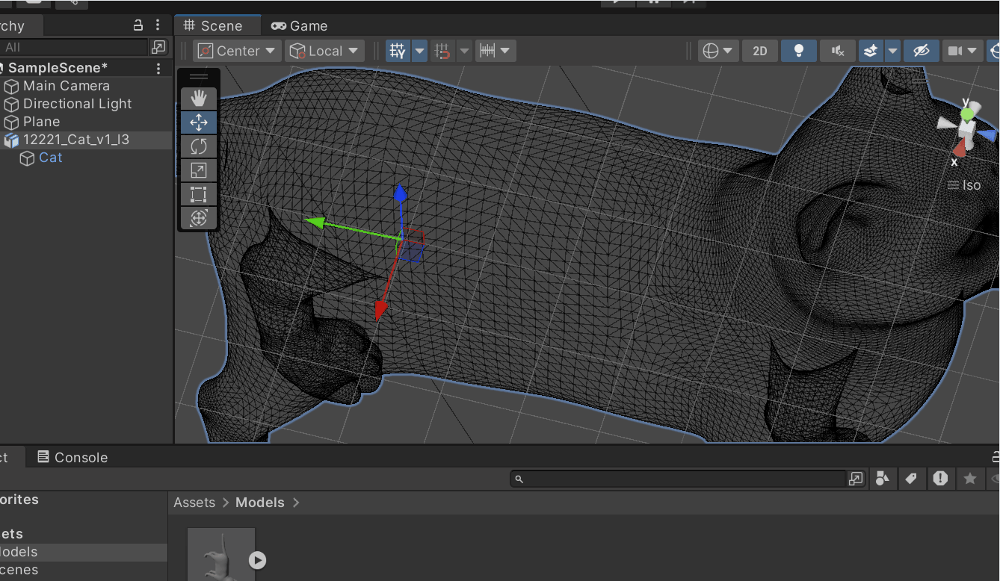
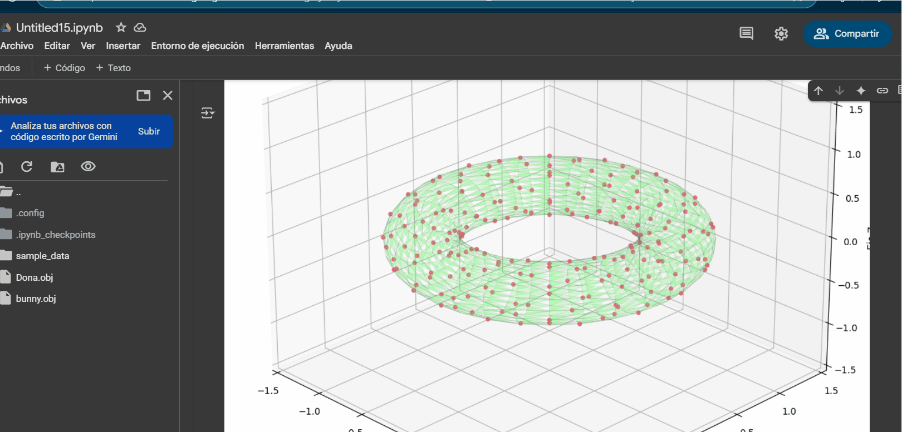

# 🧪 Construyendo el Mundo 3D: Vértices, Aristas y Caras

## 📅 Fecha
`2025-05-05` – Fecha de entrega

---

## 🎯 Objetivo del Taller

Comprender las estructuras gráficas básicas que forman los modelos 3D (mallas poligonales) y visualizar su estructura en distintas plataformas. Se explorará la diferencia entre vértice, arista y cara, así como el contenido de formatos de archivo estándar de malla como .OBJ, .STL y .GLTF.

---

## 🧠 Conceptos Aprendidos

Lista los principales conceptos aplicados:

- [ ] Importación de Modelos 3D
- [ ] Análisis de Mallas (Mesh) en Tiempo de Ejecución
- [ ] Visualización en Modo Wireframe

---

## 🔧 Herramientas y Entornos

Especifica los entornos usados:

- Python (`opencv-python`, `torch`, `mediapipe`, `diffusers`, etc.)
- Unity (versión LTS, XR Toolkit, Shader Graph)
-  Google Colab

📌 Usa las herramientas según la [guía de instalación oficial](./guia_instalacion_entornos_visual.md)

---

## 📁 Estructura del Proyecto

```
2025-05-05_taller_estructuras_3d/
├── python/               
├── unity/                 
├── README.md
```

📎 Sigue la estructura de entregas descrita en la [guía GitLab](./guia_gitlab_computacion_visual.md)

---

## 🧪 Implementación

Explica el proceso:

### 🔹 Etapas realizadas
1. Configuración del Proyecto en Unity.
2. Creación del Script C# (Análisis del Modelo).
3. Visualización Wireframe con Gizmos.
4. Alternar Vista Sólida/Wireframe.
5. Validación en el Editor

### 🔹 Código relevante

Incluye un fragmento que resuma el corazón del taller:

```C#
void PrintMeshInfo()
    {
        if (mesh == null) return;

        Debug.Log("Mesh Information:");
        Debug.Log($"Number of vertices: {mesh.vertexCount}");
        Debug.Log($"Number of triangles: {mesh.triangles.Length / 3}");
        Debug.Log($"Number of submeshes: {mesh.subMeshCount}");
    }

    void OnDrawGizmos()
    {
        if (!showWireframe || mesh == null) return;

        Gizmos.color = wireframeColor;
        Gizmos.matrix = transform.localToWorldMatrix;

        // Draw wireframe
        for (int i = 0; i < mesh.triangles.Length; i += 3)
        {
            Vector3 v1 = mesh.vertices[mesh.triangles[i]];
            Vector3 v2 = mesh.vertices[mesh.triangles[i + 1]];
            Vector3 v3 = mesh.vertices[mesh.triangles[i + 2]];

            Gizmos.DrawLine(v1, v2);
            Gizmos.DrawLine(v2, v3);
            Gizmos.DrawLine(v3, v1);
        }
    }
```

---

## 📊 Resultados Visuales

### 📌 Este taller **requiere explícitamente un GIF animado**:

> ✅ Si tu taller lo indica, debes incluir **al menos un GIF** mostrando la ejecución o interacción.





> ❌ No se aceptará la entrega si falta el GIF en talleres que lo requieren.

---

## 🧩 Prompts Usados

Enumera los prompts utilizados:

```text
"Create a step-by-step guide for a Unity workshop focused on 3D model analysis and wireframe visualization. The guide should cover: 1) Project setup in Unity LTS including 3D model import (.OBJ/.STL); 2) C# scripting to analyze and display vertex/triangle/submesh counts; 3) Two wireframe visualization methods (Gizmos for editor view and optional shader-based for runtime); 4) UI implementation with toggle buttons for view switching; 5) Validation and troubleshooting common issues; 6) Optional extensions like line thickness adjustment. Provide: numbered steps, complete C# code snippets with key explanations, visual examples of wireframe vs solid views, and warning callouts for critical steps. Format as a clear instructional document suitable for beginners, maintaining technical accuracy while avoiding unnecessary complexity. Include both editor-only and runtime solutions where applicable."
```

📎 Usa buenas prácticas de prompts según la [guía de IA actualizada](./guia_prompts_inteligencias_artificiales_actualizada.md)

---

## 💬 Reflexión Final

Responde en 2-3 párrafos:

- Primera vez que uso Unity, cosas como mover la cámara fácilmente me demoré en descubrir, pero paso a paso veo lo fuerte que es como herramienta.

---
