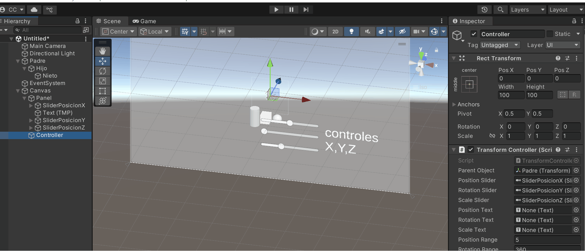

# 🧪 Jerarquías y Transformaciones: El Árbol del Movimiento

## 📅 Fecha
`2025-05-05` – Fecha de entrega

---

## 🎯 Objetivo del Taller

Aplicar estructuras jerárquicas y árboles de transformación para organizar escenas y simular movimiento relativo entre objetos. Se busca comprender cómo las transformaciones afectan a los nodos hijos en una estructura padre-hijo y cómo visualizar estos efectos en tiempo real.

---

## 🧠 Conceptos Aprendidos

Lista los principales conceptos aplicados:

- [ ] Jerarquía de Objetos (Object Hierarchy)
- [ ] Control de Transformaciones por Script
- [ ] Interfaz de Usuario (UI) Básica y Eventos
- [ ] Visualización de Datos en la Interfaz o Consola

---

## 🔧 Herramientas y Entornos

Especifica los entornos usados:


- Unity (versión LTS, XR Toolkit, Shader Graph)


📌 Usa las herramientas según la [guía de instalación oficial](./guia_instalacion_entornos_visual.md)

---

## 📁 Estructura del Proyecto

```
2025-05-05_taller_jerarquias_transformaciones/
├── unity/               
├── README.md
```

📎 Sigue la estructura de entregas descrita en la [guía GitLab](./guia_gitlab_computacion_visual.md)

---

## 🧪 Implementación

Explica el proceso:

### 🔹 Etapas realizadas
1. Crear una escena 3D con al menos 3 objetos anidados jerárquicamente (padre → hijo → nieto).
2. Crear un script en C# para controlar las transformaciones del nodo padre con sliders (UI).
3. Observar cómo los objetos hijos heredan las transformaciones.
4. Mostrar los valores actuales de posición, rotación y escala en la interfaz o consola.

### 🔹 Código relevante

Incluye un fragmento que resuma el corazón del taller:

```C#
private void Update()
    {
        if (isAnimating)
        {
            animationTime += Time.deltaTime;
            positionSlider.value = Mathf.Sin(animationTime) * positionRange;
            rotationSlider.value = animationTime * 30f % rotationRange;
            scaleSlider.value = (Mathf.Sin(animationTime * 0.5f) * 0.5f) + 1.5f;
        }
        
        // Aplicar transformaciones
        parentObject.localPosition = new Vector3(positionSlider.value, parentObject.localPosition.y, parentObject.localPosition.z);
        parentObject.localEulerAngles = new Vector3(parentObject.localEulerAngles.x, rotationSlider.value, parentObject.localEulerAngles.z);
        parentObject.localScale = new Vector3(parentObject.localScale.x, parentObject.localScale.y, scaleSlider.value);
        
        // Actualizar textos
        positionText.text = $"Pos X: {parentObject.localPosition.x:F2}";
        rotationText.text = $"Rot Y: {parentObject.localEulerAngles.y:F2}";
        scaleText.text = $"Esc Z: {parentObject.localScale.z:F2}";
        
        // Mostrar valores de los hijos en consola (opcional)
        Debug.Log($"Padre: {parentObject.localPosition}, Hijo: {parentObject.GetChild(0).localPosition}, Nieto: {parentObject.GetChild(0).GetChild(0).localPosition}");
    }
```

---

## 📊 Resultados Visuales

### 📌 Este taller **requiere explícitamente un GIF animado**:

> ✅ Si tu taller lo indica, debes incluir **al menos un GIF** mostrando la ejecución o interacción.



> ❌ No se aceptará la entrega si falta el GIF en talleres que lo requieren.

---

## 🧩 Prompts Usados

Enumera los prompts utilizados:

```text
no se usarn prompst pero se uso el siguiente video de guia 
(https://www.youtube.com/watch?v=x3FbFa843Pw)
```

📎 Usa buenas prácticas de prompts según la [guía de IA actualizada](./guia_prompts_inteligencias_artificiales_actualizada.md)

---

## 💬 Reflexión Final

Responde en 2-3 párrafos:

- En internet hay un montón de cosas, sobre todo para aprender lo básico, que creo que es justo lo que vemos en este taller. Igual, siempre me ha costado un rato pillar cómo va Unity.

---