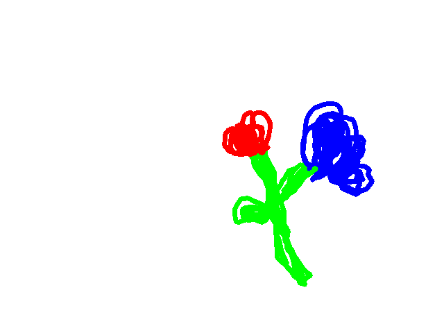

# 🖌️ Taller - Pintura Interactiva: Voz y Gestos

📅 Fecha: 2025-06-25  
🎓 Curso: Computación Visual  
👤 Estudiante: David  López

---

## 🎯 Objetivo del Taller

Crear una obra digital controlada por **voz** y **gestos**, permitiendo dibujar sin teclado ni mouse. El cuerpo y la voz se convierten en herramientas artísticas.

---

## 🛠️ Herramientas Utilizadas

- `Python`
- `MediaPipe` (detección de mano)
- `OpenCV` (visualización y dibujo)
- `speech_recognition` + `PyAudio` (voz)
- `NumPy`

---

## 🧠 Flujo de Trabajo

```plaintext
🎙️ Voz: Cambia color / limpia / guarda
🖐️ Gesto (índice): Controla el trazo del pincel
          ↓
     Dibujo en tiempo real
          ↓
   Exportación de imagen final


## 🖼️ Evidencias Visuales

### 🎬 Proceso de dibujo (GIF)


### 🖼️ Obra final exportada



💡 Reflexión Creativa
Pintar con mi cuerpo fue una experiencia nueva. Me sentí libre, como si pudiera expresarme sin barreras físicas. Coordinar la voz y el movimiento tomó algo de práctica, pero el resultado fue muy gratificante. Esta forma de interacción podría tener gran impacto en educación o accesibilidad.

🧪 Cómo ejecutar
Abre terminal en la carpeta python

Ejecuta:

bash
Copiar
Editar
python main.py
Usa tu dedo índice y comandos de voz.
Presiona "q" para salir.

📁 Estructura del proyecto
css
Copiar
Editar
2025-06-25_taller_pintura_interactiva_voz_gestos/
├── python/
│   └── main.py
├── obras/
│   ├── resultado_final.png
│   └── ejemplo_proceso.gif
└── README.md

